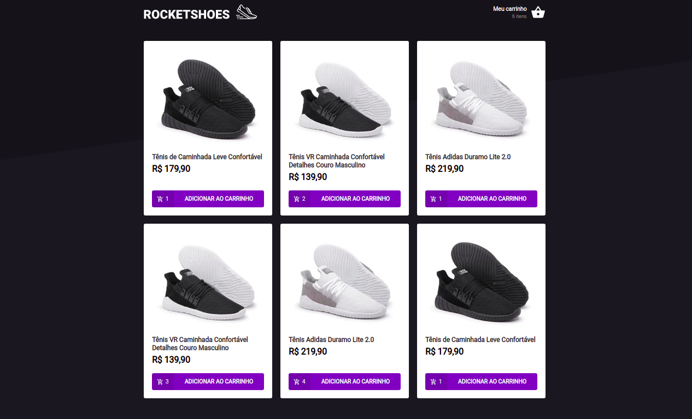
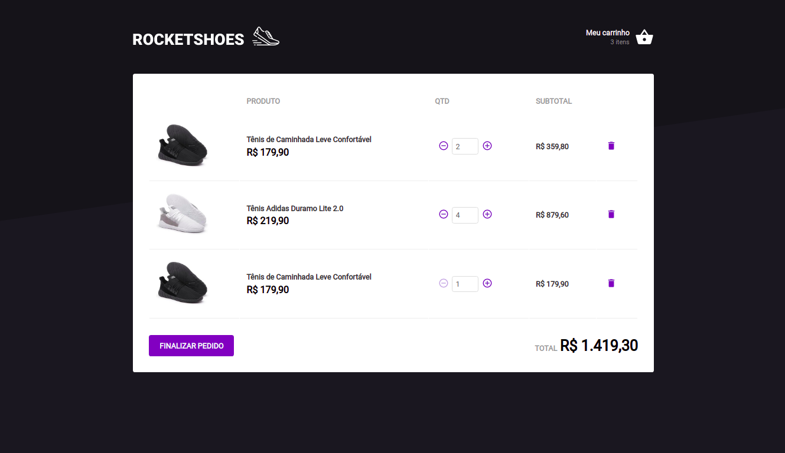

<h1 align="center">Rocketshoes</h1>

<p align="center">
  
  
  <a href="https://github.com/jtiagosantos/Rocketshoes/commits/master">
    
  </a>
  
   <a href="https://github.com/jtiagosantos/Rocketshoes/stargazers">
    
  </a>
</p>

<h4 align="center"> 
	🚧  Rocketshoes 👟 Completed 🚀 🚧
</h4>

<p align="center">
  <a href="#-features">Features</a> •
  <a href="#-run-project">Run Project</a> • 
  <a href="#-technologies">Technologies</a> • 
  <a href="#-author">Author</a> • 
  <a href="#-license">License</a>
</p>

<br>

<h1 align="center">
    
</h1>

<h1 align="center">
    
</h1>

<hr />

## ⚙️ Features

- [x] Read shoes
- [x] Add shoes to cart
- [x] Delete shoes from cart
- [x] Increment the number of shoes in the cart  
- [x] Decrement the number of shoes in the cart

<hr>

## 🚀 Run Project

1️⃣ Clone project and access its folder:

```bash
$ git clone https://github.com/jtiagosantos/Rocketshoes.git
$ cd Rocketshoes
```

2️⃣ Install dependencies:

```bash
$ yarn ou npm i
```

3️⃣ Start server:

```bash
$ yarn server ou npm run server
```
4️⃣ Start project:

```bash
$ yarn start ou npm run start
```

<hr>

## 🛠 Technologies

The following tools were used in the construction of project:

- **[React](https://reactjs.org/)**
- **[Typescript](https://www.typescriptlang.org/)**
- **[Styled Components](https://sass-lang.com/)**
- **[Json Server](https://github.com/typicode/json-server)**
- **[Jest](https://jestjs.io/)**

<hr>

## 👨‍💻 Author


<strong><a href="https://github.com/jtiagosantos">Tiago Santos </a>🚀</strong>

[](https://www.linkedin.com/in/josetiagosantosdelima/)
[](mailto:tiago.santos@icomp.ufam.edu.br)

<hr>

## 📝 License

This project is under license [MIT](./LICENSE).
